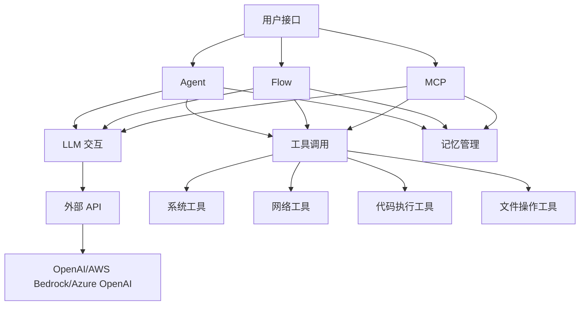
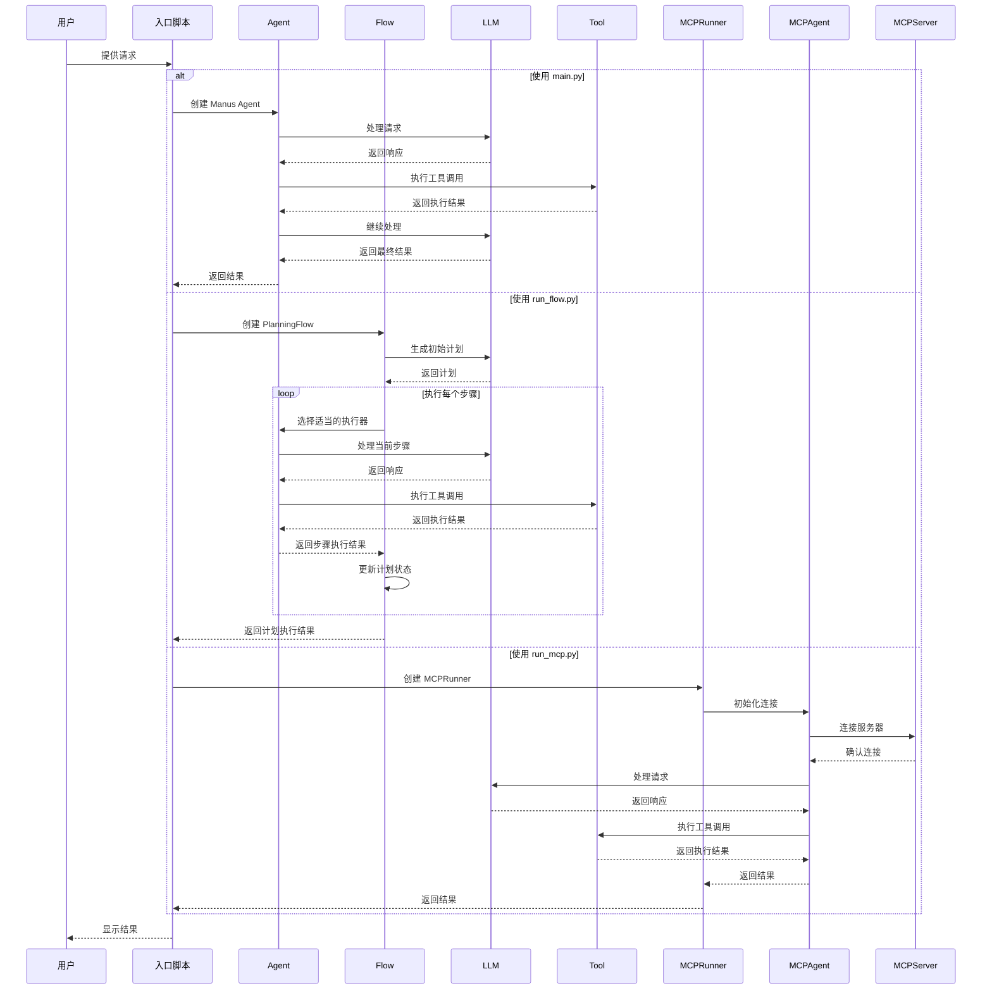

# OpenManus 项目技术文档

## 目录

- [项目概述](#项目概述)
- [系统架构](#系统架构)
- [目录结构](#目录结构)
- [核心模块](#核心模块)
  - [Agent](#agent)
  - [Flow](#flow)
  - [MCP](#mcp)
  - [工具](#工具)
  - [LLM 交互](#llm-交互)
  - [数据模型](#数据模型)
- [工作流程](#工作流程)
- [入口点](#入口点)
- [配置方式](#配置方式)
- [API 参考](#api-参考)
- [关键接口与函数](#关键接口与函数)

## 项目概述

OpenManus 是一个开源的 AI Agent 框架，旨在创建通用型 AI 代理，无需邀请码即可实现各种想法。该项目由 MetaGPT 团队成员开发，核心作者包括 Xinbin Liang 和 Jinyu Xiang。

OpenManus 提供了一个灵活的基础设施，支持多种 Agent 类型（如 ReAct、Chain-of-Thought、Planning 等），能够执行复杂任务（如代码编写、网页浏览、信息检索等）。它通过大型语言模型（如 GPT-4、Claude）的能力，结合工具调用、规划、记忆管理等机制，使 AI 能够理解、分析和完成用户的各种请求。

## 系统架构

OpenManus 采用模块化设计，主要由以下几个部分组成：



## 目录结构

项目的完整目录结构如下：

```
.
├── .git/              # Git 仓库元数据
├── .github/           # GitHub Actions 工作流等
├── .venv_py313/       # Python 虚拟环境
├── .vscode/           # VS Code 配置
├── app/               # 核心应用代码
│   ├── agent/         # 不同类型的 Agent 实现
│   │   ├── base.py    # Agent 基类
│   │   ├── browser.py # 浏览器 Agent
│   │   ├── cot.py     # Chain-of-Thought Agent
│   │   ├── manus.py   # Manus Agent
│   │   ├── mcp.py     # MCP Agent
│   │   ├── planning.py # 规划 Agent
│   │   ├── react.py   # ReAct Agent
│   │   ├── swe.py     # 软件工程 Agent
│   │   └── toolcall.py # 工具调用 Agent
│   ├── flow/          # 工作流定义和工厂
│   │   ├── base.py    # Flow 基类
│   │   ├── flow_factory.py # Flow 工厂
│   │   └── planning.py # 规划工作流实现
│   ├── mcp/           # 多组件流程
│   │   ├── __init__.py
│   │   └── server.py  # MCP 服务器
│   ├── prompt/        # 按 Agent 类型组织的提示词
│   │   ├── browser.py # 浏览器 Agent 提示词
│   │   ├── cot.py     # CoT Agent 提示词
│   │   ├── manus.py   # Manus Agent 提示词
│   │   ├── mcp.py     # MCP Agent 提示词
│   │   ├── planning.py # 规划 Agent 提示词
│   │   ├── swe.py     # 软件工程 Agent 提示词
│   │   └── toolcall.py # 工具调用提示词
│   ├── sandbox/       # 代码执行沙箱
│   │   └── client.py  # 沙箱客户端
│   ├── tool/          # 可供 Agent 调用的工具
│   │   ├── search/    # 搜索相关工具
│   │   ├── base.py    # 工具基类
│   │   ├── bash.py    # Bash 执行工具
│   │   ├── browser_use_tool.py # 浏览器工具
│   │   ├── create_chat_completion.py # 聊天完成工具
│   │   ├── file_operators.py # 文件操作工具
│   │   ├── file_saver.py # 文件保存工具
│   │   ├── mcp.py     # MCP 工具
│   │   ├── planning.py # 规划工具
│   │   ├── python_execute.py # Python 执行工具
│   │   ├── str_replace_editor.py # 字符串替换编辑器
│   │   ├── terminal.py # 终端工具
│   │   ├── terminate.py # 终止工具
│   │   ├── tool_collection.py # 工具集合
│   │   └── web_search.py # 网络搜索工具
│   ├── bedrock.py     # AWS Bedrock 交互逻辑
│   ├── config.py      # 项目配置
│   ├── exceptions.py  # 自定义异常
│   ├── __init__.py    # 包初始化
│   ├── llm.py         # 通用 LLM 交互逻辑
│   ├── logger.py      # 日志记录
│   └── schema.py      # 数据模型/模式定义
├── assets/            # 静态资源
├── config/            # 配置文件目录
├── examples/          # 示例用法
├── logs/              # 日志文件
├── tests/             # 测试代码
├── workspace/         # Agent 工作空间
├── main.py            # Manus Agent 入口脚本
├── requirements.txt   # Python 依赖
├── run_flow.py        # 运行工作流的脚本
├── run_mcp.py         # 运行 MCP 的脚本
├── run_mcp_server.py  # 运行 MCP 服务器的脚本
└── setup.py           # Python 包安装脚本
```

## 核心模块

### Agent

Agent 是 OpenManus 的核心组件，负责执行各种任务。所有 Agent 都继承自 `BaseAgent` 类。

#### BaseAgent 类

`BaseAgent` 是所有 Agent 的抽象基类，定义了状态管理、记忆管理和基于步骤的执行循环的基本功能。

主要属性：

- `name`: Agent 名称
- `description`: Agent 描述
- `system_prompt`: 系统级指令提示
- `next_step_prompt`: 决定下一步行动的提示
- `llm`: 语言模型实例
- `memory`: Agent 的记忆存储
- `state`: 当前 Agent 状态
- `max_steps`: 终止前的最大步骤数
- `current_step`: 执行中的当前步骤

主要方法：

- `run(request)`: 异步执行 Agent 的主循环
- `step()`: 执行 Agent 工作流中的单个步骤（子类必须实现）
- `update_memory(role, content, ...)`: 向 Agent 的记忆添加消息
- `is_stuck()`: 检查 Agent 是否陷入循环

#### 具体 Agent 实现

- **Manus** (`manus.py`): 通用 Agent，使用规划解决各种任务
- **BrowserAgent** (`browser.py`): 专注于网页浏览和交互
- **MCPAgent** (`mcp.py`): 与 MCP 服务器交互的 Agent
- **ReActAgent** (`react.py`): 实现 ReAct（推理和行动）循环
- **CoTAgent** (`cot.py`): 实现 Chain-of-Thought 推理
- **PlanningAgent** (`planning.py`): 专注于任务规划
- **SWEAgent** (`swe.py`): 软件工程 Agent
- **ToolCallingAgent** (`toolcall.py`): 专门处理工具调用的 Agent

### Flow

Flow 是一种编排 Agent 执行复杂任务的机制。

#### BaseFlow 类

`BaseFlow` 是所有工作流的基类，提供了初始化和执行的通用接口。

#### PlanningFlow 类

`PlanningFlow` 是最主要的工作流实现，管理任务的规划和执行。

主要属性：

- `llm`: LLM 实例
- `planning_tool`: 规划工具实例
- `executor_keys`: 执行器键列表
- `active_plan_id`: 当前活动计划 ID
- `current_step_index`: 当前步骤索引

主要方法：

- `execute(input_text)`: 执行规划工作流
- `_create_initial_plan(request)`: 创建初始计划
- `_get_current_step_info()`: 识别第一个未完成步骤
- `_execute_step(executor, step_info)`: 执行当前步骤
- `_mark_step_completed()`: 将当前步骤标记为已完成

#### FlowFactory 类

`FlowFactory` 根据配置创建 Flow 实例，支持不同类型的工作流。

### MCP

MCP (Multi-Component Process) 提供了一种服务器-客户端架构，用于协调多个组件执行任务。

#### MCPServer 类

`MCPServer` 提供 API 接口来接收任务、分发给不同组件、汇集结果。

#### MCPRunner 类

`MCPRunner` 是 MCP Agent 的运行器，负责启动和管理 MCP 会话。

主要方法：

- `initialize(connection_type, server_url)`: 初始化 MCP Agent 连接
- `run_interactive()`: 交互式运行 Agent
- `run_single_prompt(prompt)`: 使用单个提示运行 Agent
- `run_default()`: 以默认模式运行 Agent

### 工具

工具是 Agent 可以调用的外部功能，用于与外部世界交互。所有工具都继承自 `BaseTool` 类。

#### 主要工具类

- **PythonExecute**: 执行 Python 代码片段
- **BrowserUseTool**: 浏览和操作网页
- **StrReplaceEditor**: 编辑文本文件
- **Terminate**: 终止当前执行
- **WebSearch**: 搜索网络信息
- **FileOperators**: 操作文件系统
- **Bash**: 执行 Bash 命令
- **PlanningTool**: 创建和管理任务计划

#### ToolCollection 类

`ToolCollection` 管理工具集合，提供工具的注册、查找和执行功能。

### LLM 交互

`app/llm.py` 和 `app/bedrock.py` 提供了与不同 LLM 服务交互的接口。

#### LLM 类

`LLM` 类封装了与 LLM 的通用交互逻辑，支持多种 API 类型。

主要方法：

- `ask(messages, system_msgs, ...)`: 向 LLM 发送请求并获取文本响应
- `ask_with_images(messages, images, ...)`: 发送包含图像的请求
- `ask_tool(messages, tools, tool_choice, ...)`: 发送工具调用请求并获取工具调用响应

#### TokenCounter 类

`TokenCounter` 负责计算 LLM 请求中的令牌数量，帮助管理令牌限制。

主要方法：

- `count_text(text)`: 计算文本的令牌数
- `count_image(image_item)`: 计算图像的令牌数
- `count_message_tokens(messages)`: 计算消息列表的总令牌数

#### BedrockClient 类

`BedrockClient` 封装了与 AWS Bedrock 的交互逻辑。

### 数据模型

`app/schema.py` 定义了项目中使用的数据结构。

#### 枚举类型

- **Role**: 消息角色选项 (system, user, assistant, tool)
- **ToolChoice**: 工具选择选项 (none, auto, required)
- **AgentState**: Agent 执行状态 (IDLE, RUNNING, FINISHED, ERROR)

#### 数据类

- **Message**: 表示对话中的消息，支持不同角色和内容类型
- **Memory**: Agent 的记忆存储，管理消息历史
- **Function**: 表示函数定义
- **ToolCall**: 表示消息中的工具/函数调用

## 工作流程

以下是 OpenManus 的主要工作流程图：



## 入口点

OpenManus 提供了多种入口点，针对不同的使用场景：

### main.py

```python
# 核心功能：使用 Manus Agent 处理单个请求
async def main():
    agent = Manus()
    try:
        prompt = input("Enter your prompt: ")
        if not prompt.strip():
            logger.warning("Empty prompt provided.")
            return

        logger.warning("Processing your request...")
        await agent.run(prompt)
        logger.info("Request processing completed.")
    except KeyboardInterrupt:
        logger.warning("Operation interrupted.")
```

### run_flow.py

```python
# 核心功能：使用 PlanningFlow 处理请求，支持多个 Agent 协作
async def run_flow():
    agents = {
        "manus": Manus(),
    }

    try:
        prompt = input("Enter your prompt: ")
        if prompt.strip().isspace() or not prompt:
            logger.warning("Empty prompt provided.")
            return

        flow = FlowFactory.create_flow(
            flow_type=FlowType.PLANNING,
            agents=agents,
        )
        logger.warning("Processing your request...")

        result = await asyncio.wait_for(
            flow.execute(prompt),
            timeout=3600,  # 60 分钟超时
        )
        # ...处理结果...
    # ...异常处理...
```

### run_mcp.py

```python
# 核心功能：运行 MCP Agent，支持多种连接模式和交互方式
async def run_mcp():
    args = parse_args()
    runner = MCPRunner()

    try:
        # 初始化 MCP Agent 连接
        await runner.initialize(args.connection, args.server_url)

        # 根据参数选择运行模式
        if args.prompt:
            await runner.run_single_prompt(args.prompt)
        elif args.interactive:
            await runner.run_interactive()
        else:
            await runner.run_default()
    # ...异常处理...
    finally:
        await runner.cleanup()
```

### cli_run.py (命令行参数入口)

这是一个统一的命令行工具，允许用户直接通过命令行参数传递提示词，支持所有三种运行模式 (agent, flow, mcp)：

```bash
# 基本用法
python cli_run.py "你的提示词"

# 指定运行模式
python cli_run.py --mode agent "使用 Manus Agent 处理这个请求"
python cli_run.py --mode flow "使用 PlanningFlow 处理这个请求"
python cli_run.py --mode mcp "使用 MCP Agent 处理这个请求"

# 缩写形式
python cli_run.py -m flow "简短的模式指定"

# MCP 模式的特殊选项
python cli_run.py -m mcp --connection sse --server-url "http://example.com/sse" "使用 SSE 连接到远程 MCP 服务器"
```

完整帮助信息可通过以下命令查看：

```bash
python cli_run.py --help
```

## 配置方式

OpenManus 使用 TOML 配置文件（`config/config.toml`）进行配置。主要配置项包括：

```toml
# 全局 LLM 配置
[llm]
model = "gpt-4o"
base_url = "https://api.openai.com/v1"
api_key = "sk-..."  # 替换为实际 API 密钥
max_tokens = 4096
temperature = 0.0

# 特定 LLM 模型的可选配置
[llm.vision]
model = "gpt-4o"
base_url = "https://api.openai.com/v1"
api_key = "sk-..."  # 替换为实际 API 密钥
```

## API 参考

### Agent API

```python
# 创建 Agent
agent = Manus()

# 运行 Agent
await agent.run("实现一个简单的网页抓取工具")

# 获取 Agent 状态
state = agent.state  # 返回 AgentState 枚举值
```

### Flow API

```python
# 创建 Flow
flow = FlowFactory.create_flow(
    flow_type=FlowType.PLANNING,
    agents={"manus": Manus()},
)

# 执行 Flow
result = await flow.execute("将这个仓库的 stars 数据可视化")
```

### MCP API

```python
# 创建 MCPRunner
runner = MCPRunner()

# 初始化连接
await runner.initialize("stdio")

# 运行单个提示
await runner.run_single_prompt("分析这个 CSV 文件的内容")

# 清理资源
await runner.cleanup()
```

## 关键接口与函数

### 1. BaseAgent 类（`app/agent/base.py`）

```python
async def run(self, request: Optional[str] = None) -> str:
    """执行 Agent 的主循环"""
    # 初始化请求
    if request:
        self.update_memory("user", request)

    # 执行步骤循环
    async with self.state_context(AgentState.RUNNING):
        while (self.current_step < self.max_steps
               and self.state != AgentState.FINISHED):
            # 执行单个步骤
            self.current_step += 1
            step_result = await self.step()

            # 检查卡住状态
            if self.is_stuck():
                self.handle_stuck_state()

            # 记录结果
            results.append(f"Step {self.current_step}: {step_result}")

    # 清理沙箱环境
    await SANDBOX_CLIENT.cleanup()
    return "\n".join(results) if results else "No steps executed"
```

### 2. LLM 类（`app/llm.py`）

```python
async def ask_tool(
    self,
    messages: List[Union[dict, Message]],
    system_msgs: Optional[List[Union[dict, Message]]] = None,
    timeout: int = 300,
    tools: Optional[List[dict]] = None,
    tool_choice: TOOL_CHOICE_TYPE = ToolChoice.AUTO,
    temperature: Optional[float] = None,
    **kwargs,
) -> ChatCompletionMessage | None:
    """向 LLM 发送工具调用请求并获取响应"""
    # 格式化消息
    formatted_messages = self.format_messages(messages, self._supports_images())
    if system_msgs:
        system_formatted = self.format_messages(system_msgs, self._supports_images())
        formatted_messages = system_formatted + formatted_messages

    # 检查令牌限制
    input_tokens = self.count_message_tokens(formatted_messages)
    if not self.check_token_limit(input_tokens):
        error_msg = self.get_limit_error_message(input_tokens)
        raise TokenLimitExceeded(error_msg)

    # 根据 API 类型调用不同的 LLM 接口
    if self.api_type == "aws":
        response = await self._bedrock_ask_tool(
            messages=formatted_messages,
            tools=tools,
            tool_choice=tool_choice,
            temperature=temperature or self.temperature,
            timeout=timeout,
            **kwargs,
        )
    else:
        response = await self._openai_ask_tool(
            messages=formatted_messages,
            tools=tools,
            tool_choice=tool_choice,
            temperature=temperature or self.temperature,
            timeout=timeout,
            **kwargs,
        )

    # 更新令牌计数
    completion_tokens = self.count_tokens(response.content or "")
    self.update_token_count(input_tokens, completion_tokens)

    return response
```

### 3. PlanningFlow 类（`app/flow/planning.py`）

```python
async def execute(self, input_text: str) -> str:
    """执行规划工作流与代理"""
    try:
        # 验证主要代理可用
        if not self.primary_agent:
            raise ValueError("No primary agent available")

        # 如果提供了输入，创建初始计划
        if input_text:
            await self._create_initial_plan(input_text)

            # 验证计划创建成功
            if self.active_plan_id not in self.planning_tool.plans:
                logger.error(f"Plan creation failed. Plan ID {self.active_plan_id} not found in planning tool.")
                return f"Failed to create plan for: {input_text}"

        result = ""
        # 执行计划的每个步骤
        while True:
            # 获取当前要执行的步骤
            self.current_step_index, step_info = await self._get_current_step_info()

            # 如果没有更多步骤或计划完成，退出
            if self.current_step_index is None:
                result += await self._finalize_plan()
                break

            # 用适当的代理执行当前步骤
            step_type = step_info.get("type") if step_info else None
            executor = self.get_executor(step_type)
            step_result = await self._execute_step(executor, step_info)
            result += step_result + "\n"

            # 检查代理是否要终止
            if hasattr(executor, "state") and executor.state == AgentState.FINISHED:
                break

        return result
    except Exception as e:
        logger.error(f"Error in PlanningFlow: {str(e)}")
        return f"Execution failed: {str(e)}"
```

### 4. Message 类（`app/schema.py`）

```python
class Message(BaseModel):
    """表示对话中的聊天消息"""

    role: ROLE_TYPE = Field(...)  # 角色（user, system, assistant, tool）
    content: Optional[str] = Field(default=None)  # 内容
    tool_calls: Optional[List[ToolCall]] = Field(default=None)  # 工具调用
    name: Optional[str] = Field(default=None)  # 名称（用于工具消息）
    tool_call_id: Optional[str] = Field(default=None)  # 工具调用 ID
    base64_image: Optional[str] = Field(default=None)  # Base64 编码的图像

    # 消息创建的便捷方法
    @classmethod
    def user_message(cls, content: str, base64_image: Optional[str] = None) -> "Message":
        """创建用户消息"""
        return cls(role=Role.USER, content=content, base64_image=base64_image)

    @classmethod
    def system_message(cls, content: str) -> "Message":
        """创建系统消息"""
        return cls(role=Role.SYSTEM, content=content)

    @classmethod
    def assistant_message(cls, content: Optional[str] = None, base64_image: Optional[str] = None) -> "Message":
        """创建助手消息"""
        return cls(role=Role.ASSISTANT, content=content, base64_image=base64_image)

    @classmethod
    def tool_message(cls, content: str, name, tool_call_id: str, base64_image: Optional[str] = None) -> "Message":
        """创建工具消息"""
        return cls(role=Role.TOOL, content=content, name=name, tool_call_id=tool_call_id, base64_image=base64_image)
```

### 5. ToolCollection 类（`app/tool/tool_collection.py`）

```python
class ToolCollection:
    """管理工具集合类"""

    def __init__(self, *tools):
        """初始化工具集合"""
        self.tools = {}
        for tool in tools:
            self.add_tool(tool)

    def add_tool(self, tool) -> None:
        """添加工具到集合"""
        tool_name = tool.__class__.__name__.lower()
        self.tools[tool_name] = tool

    def get_tool(self, tool_name: str):
        """通过名称获取工具"""
        return self.tools.get(tool_name.lower())

    async def execute_tool(self, tool_name: str, **kwargs):
        """执行指定的工具"""
        tool = self.get_tool(tool_name)
        if not tool:
            raise ValueError(f"Tool {tool_name} not found")
        return await tool.execute(**kwargs)

    def to_parameters(self) -> List[dict]:
        """将工具转换为 API 参数格式"""
        return [tool.to_param() for tool in self.tools.values()]
```
